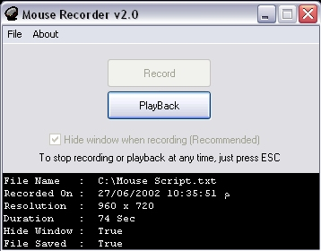



## Mouse Recorder v2\.0 \(Capturing Clicks & Making Scripts\!\)

### Description

Record your mouse movements & clicks for left, middle & right buttons! You can save them to a *.txt file for later use. this is so COOL :) Watch the program record & play all your mouse actions. For appropriate PlayBack, the program checks your current screen resolution to make sure it matches the resolution of the recorded script.
 
### More Info
 
You Must not Change Screen Resolution While Recording, for appropriate PlayBack later.

             |
---                |---
**Submitted On**   |2002-06-27 22:52:00
**By**             |[Waleed A\. Aly](https://github.com/Planet-Source-Code/PSCIndex/blob/master/ByAuthor/waleed-a-aly.md)
**Level**          |Intermediate
**User Rating**    |5.0 (105 globes from 21 users)
**Compatibility**  |VB 5\.0, VB 6\.0
**Category**       |[Miscellaneous](https://github.com/Planet-Source-Code/PSCIndex/blob/master/ByCategory/miscellaneous__1-1.md)
**World**          |[Visual Basic](https://github.com/Planet-Source-Code/PSCIndex/blob/master/ByWorld/visual-basic.md)
**Archive File**   |[Mouse\_Reco995386272002\.zip](https://github.com/Planet-Source-Code/waleed-a-aly-mouse-recorder-v2-0-capturing-clicks-making-scripts__1-36323/archive/master.zip)

